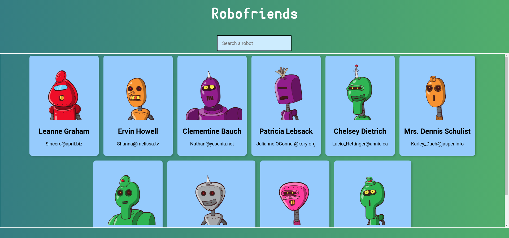

# Project Title

## :book: Description 
Robofriends App created with Create React App for Udemy's course "The Complete Web Developer Course.

### :dart: Features 
List of all the features of the project 

- SPA created with Create React App
- Uses Robohash API
- Styled with Tachyons

### :high_brightness: Visuals


## :bulb: Getting Started 
Follow the instructions below to get a copy of the project, whether it's for development or testing purposes. 

### :clipboard: Prerequisites
You'll need Git, and Node.js (which comes with npm) installed on your computer.
```
node@v12.13.0 or higher
npm@6.13.1 or higher
git@2.17.1 or higher
```

### :computer: Installation
```
# Clone this repository
$ git clone https://github.com/miguel-osuna/Robofriends-App.git

# Go into the your local repository
$ cd example

# Remove current origin repository
$ git remote remove origin
```
Create React App will be installed under *react-scripts* when all dependencies are installed.

```
# Install all project dependencies
$ npm install 

# Start and watch the project
$ npm start
```

*Once your server has started, go to ```https://localhost:3000/``` and you will see the website running on a Development Server.*

## :rocket: Deployment
Once you are ready to deploy your project, read the [following tutorial](https://create-react-app.dev/docs/deployment) to choose your hosting

##  :wrench: Built With 
-   [React](https://reactjs.org/)  - Front-End JavaScript library

## :performing_arts: Authors 
- **Miguel Osuna** - https://github.com/miguel-osuna

## :ledger: License 
This project is licensed under the MIT License - see the LICENSE.md file for details.  


